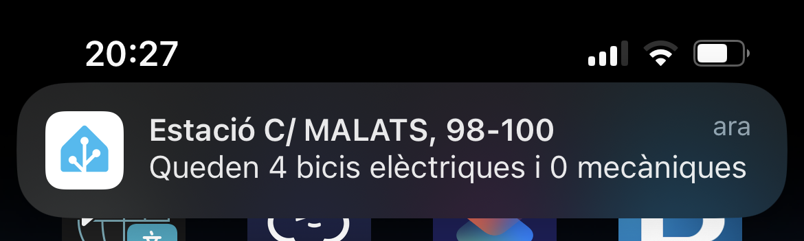

# Bicing per al Home Assistant

Integració per a Home Assistant que mostra l'estat de les estacions del Bicing de Barcelona mitjançant els datasets de dades obertes de l'Ajuntament de Barcelona.

## Funcionalitats

- Configuració completa des de la interfície de Home Assistant.
- Selecció de les estacions que vols monitoritzar.
- Quatre sensors independents per estació:
  - Bicicletes disponibles.
  - Bicicletes elèctriques disponibles.
  - Bicicletes mecàniques disponibles.
  - Ancoratges disponibles.
- Actualització coordinada cada 10 minuts.
- Reutilització de la sessió HTTP de Home Assistant.
- Cache de l'últim estat durant errors transitoris durant un màxim d'1 hora.
- Reautenticació automàtica des de la interfície quan el token és rebutjat.
- Diagnòstics amb el token redactat.
- Migració automàtica de la configuració de versions anteriors.

## Instal·lació amb HACS

També pots afegir aquest repositori manualment com a repositori personalitzat d'HACS del tipus **Integration**.

## Configuració

Necessitaràs un token del servei de dades obertes de l'Ajuntament de Barcelona. El pots obtenir gratuïtament a:

https://opendata-ajuntament.barcelona.cat/tokens

Després, a Home Assistant:

1. Ves a **Configuració → Dispositius i serveis**.
2. Afegeix la integració **Bicing Status**.
3. Introdueix el token.
4. Selecciona les estacions que vols monitoritzar.

Les estacions es poden modificar posteriorment des de **Reconfigurar** a la fitxa de la integració.

## Entitats

Cada estació seleccionada es representa com un dispositiu de Home Assistant amb aquestes entitats:

- `Bicicletes disponibles`: suma de bicicletes mecàniques i elèctriques.
- `Bicicletes elèctriques disponibles`.
- `Bicicletes mecàniques disponibles`.
- `Ancoratges disponibles`.

Això permet crear gràfics i automatitzacions sobre cada mètrica per separat.

## Actualització i errors

L'estat es consulta cada 10 minuts. Si l'API falla temporalment, la integració conserva l'últim valor conegut durant un màxim d'una hora. Quan aquest període expira, les entitats passen a **unavailable** fins que l'API torna a respondre correctament.

Els errors HTTP 401/403 provoquen el flux de reautenticació. Els errors 429 i els errors temporals del servidor respecten el mecanisme de reintent quan l'API proporciona `Retry-After`.

## Privacitat i secrets

El token de l'API només es guarda a la configuració de Home Assistant i no forma part del repositori. Els diagnòstics de la integració redacten el token abans de retornar informació.

No comparteixis mai un fitxer de backup de Home Assistant o el contingut de `.storage/core.config_entries` si conté el token.

## Origen de les dades

- [Informació de les estacions del Bicing](https://opendata-ajuntament.barcelona.cat/data/ca/dataset/informacio-estacions-bicing)
- [Estat de les estacions del Bicing](https://opendata-ajuntament.barcelona.cat/data/ca/dataset/estat-estacions-bicing)

## Desenvolupament

La integració utilitza un `DataUpdateCoordinator` compartit per totes les entitats de Bicing. La informació estàtica de les estacions es carrega una sola vegada durant la inicialització i l'estat es consulta en bloc.

Abans d'obrir un issue, comprova els logs de Home Assistant i, quan sigui possible, adjunta els diagnòstics de la integració sense compartir mai el token.

## Eliminació

Per eliminar la integració, ves a **Configuració → Dispositius i serveis → Bicing Status → ... → Elimina**.

Això eliminarà la configuració i les entitats associades a la integració.
